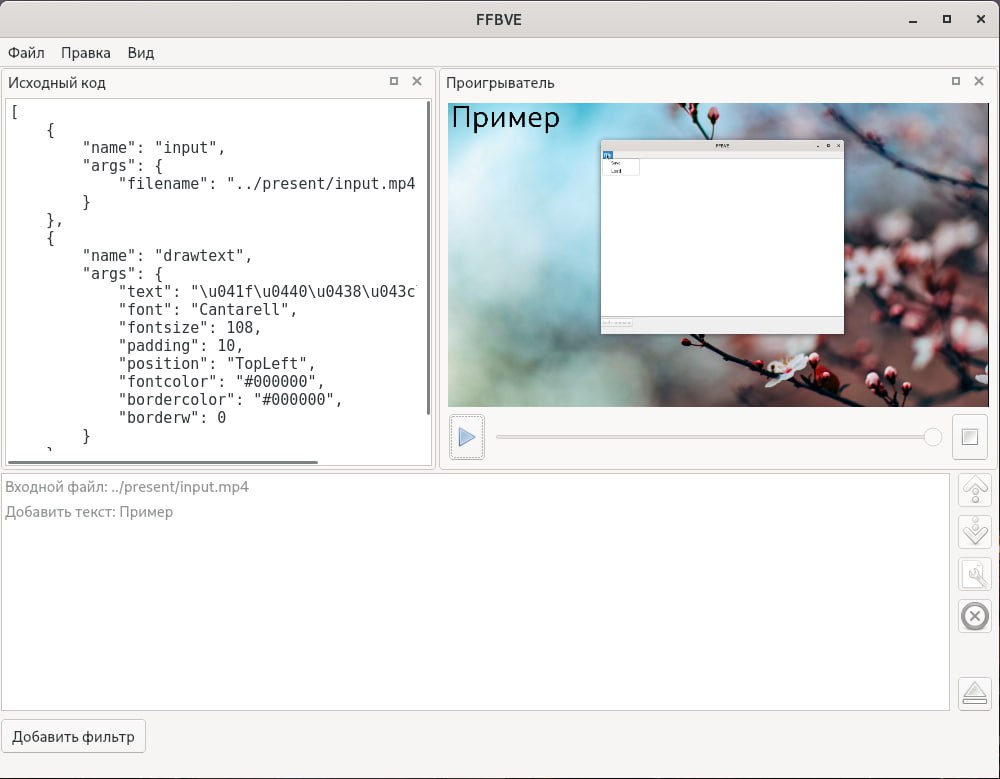
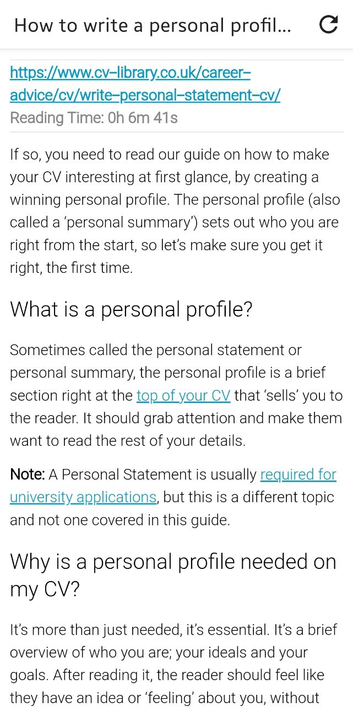
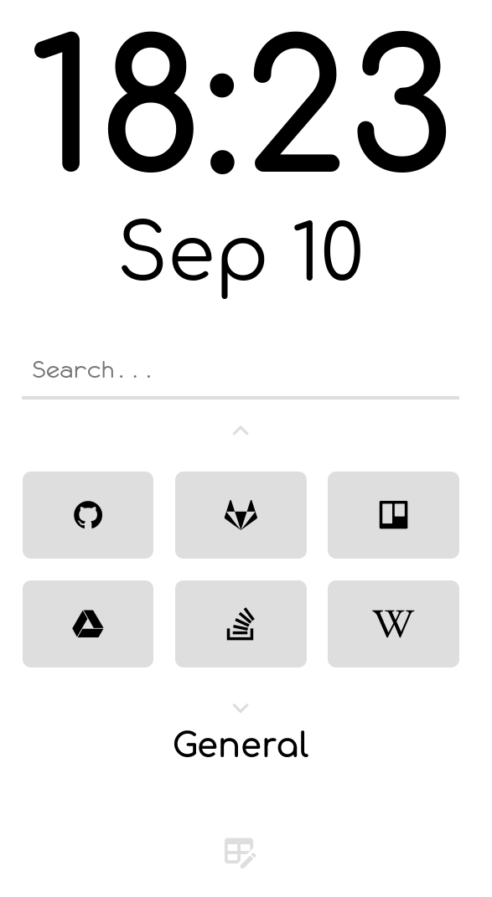
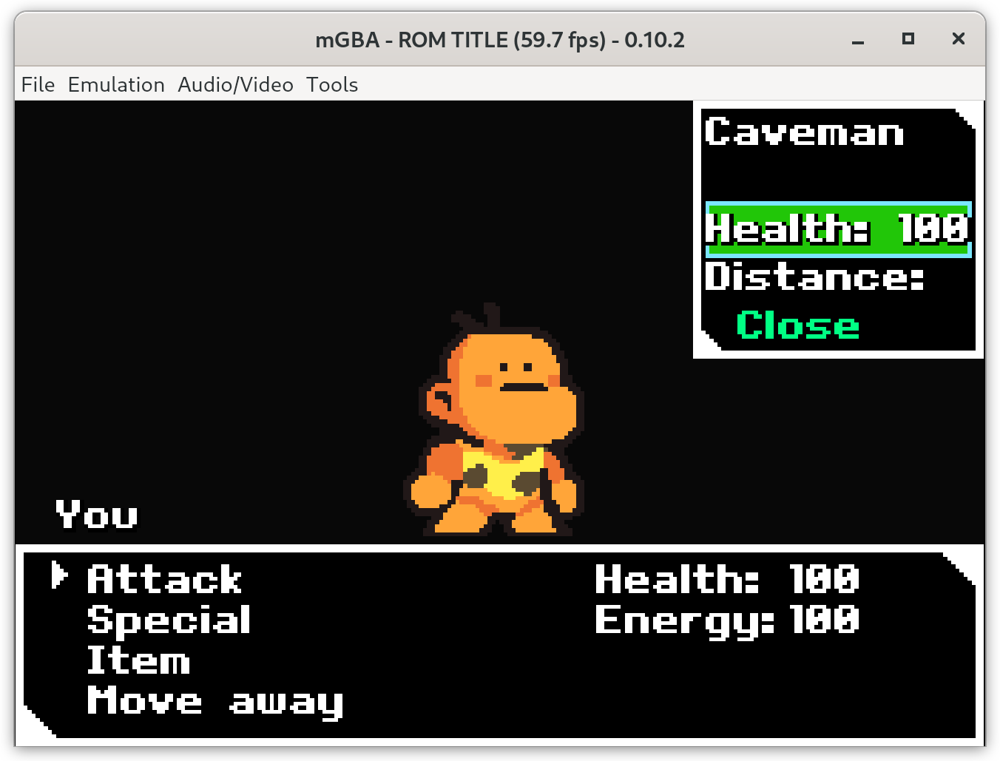
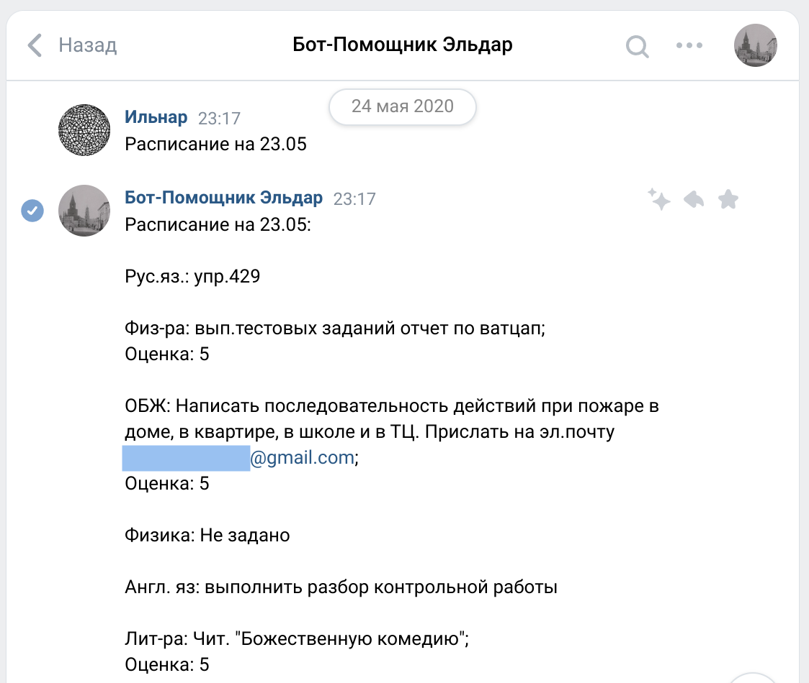
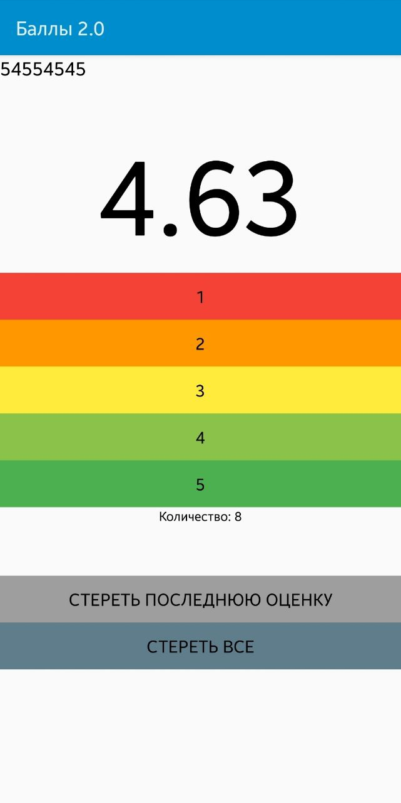

# Ilnar Gazizov

## About me

Note:

My name is Ilnar. I'm ethnically Tatar, and I lived in Kazan my whole life. I am a software engineering student at ITIS, KFU.

I've been programming for at least six years. I've written programs on a lot of different languages during that time, but now I mainly use C#, Python and C++. I've made several applications for different platforms, such as a desktop video editor, an article reader for an Android and a small web-forum, along with many other projects and games. My passion for programming I mostly own to Yandex Lyceum, which I graduated with great honours. I've also taken part in numerous programming competitions and was lucky enough to win some of those.

I guess it's quite clear now that coding is how I usually spend my pastime. Also, I like to listen to and compose music, play on a piano and learn new programming languages and techniques by reading books and articles. 

Question time:
- What is my nationality?
- Can you name at least one of my projects?
- Do I even have some hobbies outside programming?

---

<!-- .slide: data-transition="slide-in none-out" -->

Note:

**My name is Ilnar.** I'm ethnically Tatar, and I lived in Kazan my whole life. I am a software engineering student at ITIS, KFU.

---

<!-- .slide: data-transition="none" -->

Note:

My name is Ilnar. **I'm ethnically Tatar, and I lived in Kazan my whole life.** I am a software engineering student at ITIS, KFU.

---

<!-- .slide: data-transition="none" -->

Note:

My name is Ilnar. I'm ethnically Tatar, and I lived in Kazan my whole life. **I am a software engineering student at ITIS, KFU.**

---

<!-- .slide: data-transition="none" -->

Note:

**I've been programming for at least six years. I've written programs on a lot of different languages during that time, but now I mainly use** C#, Python and C++. I've made several applications for different platforms, such as a desktop video editor, an article reader for an Android and a small web-forum, along with many other projects and games. 

---

<!-- .slide: data-transition="none" -->

Note:

I've been programming for at least six years. I've written programs on a lot of different languages during that time, but now I mainly use **C#**, Python and C++. I've made several applications for different platforms, such as a desktop video editor, an article reader for an Android and a small web-forum, along with many other projects and games. 

---

<!-- .slide: data-transition="none" -->

 <!-- .element height="70%" width="70%" -->

Note:

I've been programming for at least six years. I've written programs on a lot of different languages during that time, but now I mainly use C#, **Python and** C++. I've made several applications for different platforms, such as a desktop video editor, an article reader for an Android and a small web-forum, along with many other projects and games. 

---

<!-- .slide: data-transition="none" -->

 <!-- .element height="70%" width="70%" -->

Note:

I've been programming for at least six years. I've written programs on a lot of different languages during that time, but now I mainly use C#, Python and **C++. I've made several applications for different platforms**, such as a desktop video editor, an article reader for an Android and a small web-forum, along with many other projects and games. 

---

<!-- .slide: data-transition="none" -->

 <!-- .element height="70%" width="70%" -->

Note:

I've been programming for at least six years. I've written programs on a lot of different languages during that time, but now I mainly use C#, Python and C++. I've made several applications for different platforms, **such as a desktop video editor**, an article reader for an Android and a small web-forum, along with many other projects and games. 

---

<!-- .slide: data-transition="none" -->

 <!-- .element height="30%" width="30%" -->

Note:

I've been programming for at least six years. I've written programs on a lot of different languages during that time, but now I mainly use C#, Python and C++. I've made several applications for different platforms, such as a desktop video editor, **an article reader for an Android** and a small web-forum, along with many other projects and games. 

---

<!-- .slide: data-transition="none" -->

 <!-- .element height="30%" width="30%" -->

Note:

# SKIP

... **and a small web-forum, along with many other projects and games**. 

---

<!-- .slide: data-transition="none" -->

Note:

# SKIP

... **and a small web-forum, along with many other projects and games**.

---

<!-- .slide: data-transition="none" -->

 <!-- .element height="70%" width="70%" -->

Note:

# SKIP

... **and a small web-forum, along with many other projects and games**.

---

<!-- .slide: data-transition="none" -->

 <!-- .element height="70%" width="70%" -->

Note:

# SKIP

... **and a small web-forum, along with many other projects and games**.

---

<!-- .slide: data-transition="none" -->

 <!-- .element height="30%" width="30%" -->

Note:

# SKIP

... **and a small web-forum, along with many other projects and games**.

---

<!-- .slide: data-transition="none" -->

# ...

Note:

# !!!STOP!!!

---

<!-- .slide: data-transition="none" -->

Note:

**My passion for programming I mostly own to Yandex Lyceum, which I graduated with great honours.** I've also taken part in numerous programming competitions and was lucky enough to win some of those.

---

<!-- .slide: data-transition="none" -->

 <!-- .element height="70%" width="70%" -->

Note:

My passion for programming I mostly own to Yandex Lyceum, which I graduated with great honours. **I've also taken part in numerous programming competitions and was lucky enough to win some of those.**

---

<!-- .slide: data-transition="none" -->

Note:

**I guess it's quite clear now that coding is how I usually spend my pastime.** Also, I like to listen to and compose music, play on a piano and learn new programming languages and techniques by reading books and articles. 

---

<!-- .slide: data-transition="none" -->

Note:

I guess it's quite clear now that coding is how I usually spend my pastime. **Also, I like to listen to and compose music**, play on a piano and learn new programming languages and techniques by reading books and articles. 

---

<!-- .slide: data-transition="none" -->

Note:

I guess it's quite clear now that coding is how I usually spend my pastime. Also, I like to listen to and compose music, **play on a piano** and learn new programming languages and techniques by reading books and articles. 

---

<!-- .slide: data-transition="none" -->

 <!-- .element height="50%" width="50%" -->

Note:

I guess it's quite clear now that coding is how I usually spend my pastime. Also, I like to listen to and compose music, play on a piano **and learn new programming languages and techniques by reading books and articles.** 

---

## Question time!

- What is my nationality? <!-- .element class="fragment" -->
- Can you name at least one of my projects? <!-- .element class="fragment" -->
- Do I even have some hobbies outside programming? <!-- .element class="fragment" -->

---

# Thanks!

